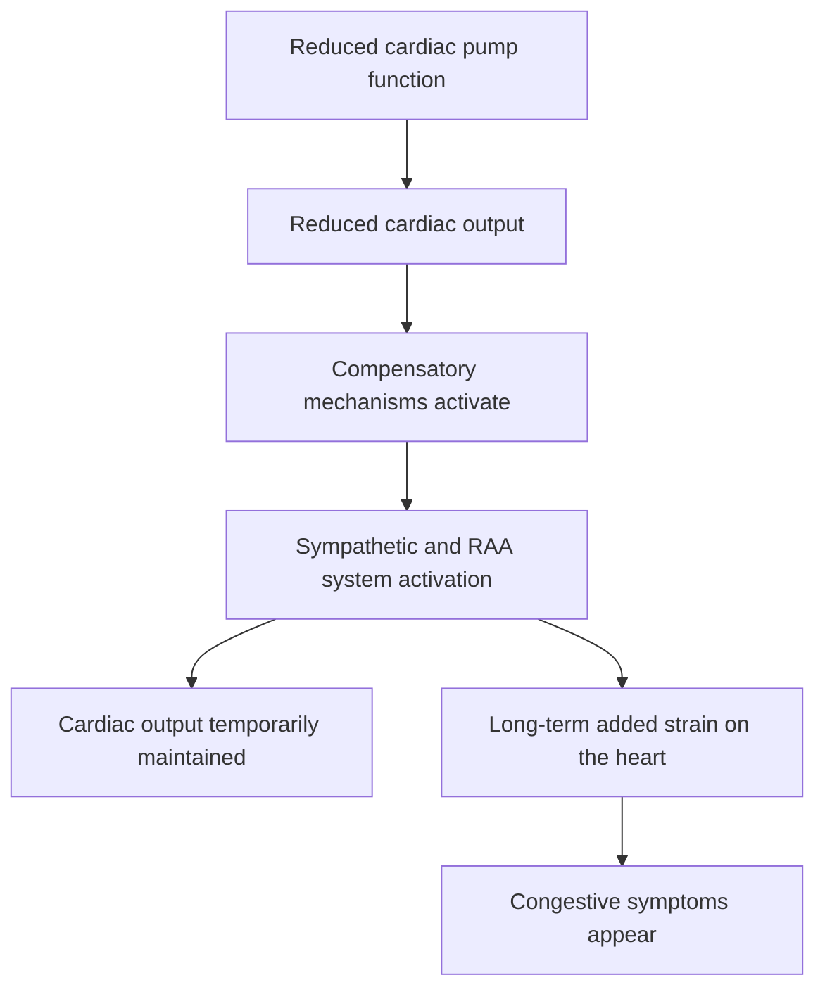

# Unit A-2: Beyond Text — How Image Generation Works and When to Use It

**Related competencies**: A2, A4 | **Estimated time**: 10 minutes

<div data-area-progress></div>

## Why This Skill Matters

A physician responsible for medical education was putting the finishing touches on lecture slides for residents late at night. Since generative AI could quickly draft the text, they thought, "Could it make the diagrams the same way?" and asked an image-generation AI for a diagram of the pathophysiology of heart failure. Within seconds, a polished-looking diagram came back. But on closer inspection later, the positions of the atria and ventricles didn't match reality — using it as-is would have spread a misunderstanding rather than clarified one. "I asked for it the same way I asked for text, so why did this kind of error happen?" The answer is that image-generation AI works on a completely different mechanism from text-generation AI. On top of that, generative AI can produce more than just text and images — slide outlines, program code, and other formats useful for clinical and educational work. Knowing this difference in mechanism, and the breadth of what generative AI can produce, is the first step toward using it safely and effectively when preparing lectures and materials.

## Core Concepts

### How image-generation AI (diffusion models) works -- a different principle from LLMs

- The LLM covered in [Unit A-1](a1.md) works by "probabilistically predicting the next word from the preceding context."
- By contrast, many image-generation AI systems (diffusion models) work by starting from an image containing random noise -- like static on an old television -- and gradually removing that noise to restore an image that approaches the given instructions.
- As an analogy, imagine looking at a scene through a fogged-up window and slowly wiping the fog away until the image comes into focus. It is not drawing one outline at a time from scratch.
- Because of this difference in mechanism, image-generation AI does not guarantee "anatomical accuracy as an image" in the same way it produces "plausibility as text." Just like the hallucination covered in Unit A-1, images can end up looking plausible while actually being wrong.

### Generative AI can produce more than text (multimodal)

- Some generative AI can produce a variety of formats beyond text: images, slide outlines, program code, audio, and diagrams (such as flowcharts written in notations like Mermaid).
- Examples of where this is useful in clinical and educational work:
    - A rough draft of a diagram or outline for lecture slides
    - A first draft of a patient-explanation handout (text plus a simple diagram idea)
    - A draft outline or abstract for a conference presentation
- In every case, the premise stays the same: it is a rough draft. You still need to check and revise the content before using it (the same idea as the verification covered in [Unit C-2](c2.md)).

## Copyable Prompt

You can experience "generative AI producing a format other than text" without using an image-generation tool. The following prompt has the AI produce, for the same clinical topic, both (1) a slide outline and (2) diagram code (in Mermaid notation), so you can compare the two.

```text
[Exercise: Generate a slide outline and diagram code]
I am preparing a 10-minute mini-lecture for residents on [enter your
lecture topic here, e.g., "the pathophysiology of heart failure" or
"initial management of sepsis"]. Please create the following two
things.

1. Slide outline: titles for 5 slides, with up to 3 bullet points
   each
2. Diagram code: a flowchart representing the flow of the content
   above, written in Mermaid notation (a code block starting with
   three backticks and "mermaid")

After creating both, explain in one sentence whether each of the two
outputs is in the form of "text" or a "diagram."
```

## Steps

1. Rewrite the bracketed [ ] portion of the prompt with a topic from your own area or interests.
2. Paste it into whatever generative AI you have on hand and run it.
3. Confirm that you received two outputs of a different nature: a slide outline (in text form) and Mermaid code (a blueprint for a diagram).
4. If the generative AI you're using supports it, the Mermaid code will be rendered directly as a diagram within the conversation. If it isn't rendered, you can paste the code into a Mermaid-compatible tool (such as mermaid.live), or simply read the structure of the code (each element connected by arrows) to confirm that the AI has assembled something with the structure of a diagram.
5. Notice that the diagram code you generated here was, in fact, produced not by a diffusion model but by the same "predict the next word" mechanism as text-generation AI. Generating an actual image -- a photo or an illustration -- uses the diffusion mechanism described above, but that hands-on experience is outside the scope of this unit (see Core Concepts).

## Example of Expected Output

The AI will return two kinds of output like the ones below (a fictional example for illustration).

**Example slide outline:**

```text
Slide 1: What is heart failure? (definition and prevalence)
Slide 2: The overall picture of the pathophysiology (a vicious cycle
that starts with reduced pump function)
Slide 3: Compensatory mechanisms (activation of the sympathetic
nervous system and the renin-angiotensin-aldosterone system)
Slide 4: What happens when compensation fails (the appearance of
congestive symptoms)
Slide 5: Connecting this to the basics of treatment (how
pathophysiology informs drug-choice reasoning)
```

**Example diagram code (Mermaid notation):**



The slide outline is "text," while the diagram code is a "blueprint for a diagram" written in Mermaid notation -- the two look and are formatted completely differently. On this site itself, this code is not rendered as an actual diagram and is displayed as text (for the purpose of comparing the two formats, that is enough).

## Common Pitfalls and How to Handle Them

- **The Mermaid code isn't rendered as a diagram**: Depending on which generative AI chat you use, the code may simply be displayed as text. In that case, just reading the structure of the code (each element connected by arrows) is enough to confirm that the AI has assembled something with the structure of a diagram.
- **The slide outline is too abstract**: Adding context such as the intended audience, time available, and level makes the output more concrete (a preview of the context-giving skill you'll learn in Area B).
- **You find yourself wanting to generate an actual image**: This unit covers only the text-based experience. Actually using image-generation AI carries the anatomical-error and copyright risks covered in the next section, so it calls for separate learning (this site is considering it as a future extension).

## Safety Note

!!! danger "Do not enter patient information"
    When running this experiment, never enter information about actual patients (name, patient ID, date of birth, detailed medical history, etc.). The experiment works perfectly well using only your own area of work or general topics of interest.

In addition, keep the following points in mind when you do use image-generation AI:

- **Anatomical errors can occur**: A diffusion model is not a mechanism that guarantees medical accuracy -- it merely restores a plausible-looking image. Generated medical diagrams can contain errors in the position, number, or connections of organs, and should never be used in a lecture or patient explanation without expert review.
- **Watch out for copyright**: A generated image can closely resemble an existing illustration, photo, or character (see [Unit C-2](c2.md)). Before publishing or distributing it, check whether it closely resembles an existing work and check the terms of service of the tool you are using.

## Self-Check Quiz

You can check your understanding of this unit. There is no pass/fail judgment, and no record is saved.

<div data-quiz-src="../../assets/data/quiz-a2-selfcheck.json"></div>

## Deliverable Feedback

At the end of the conversation where you ran the exercise, paste and send the feedback prompt from the [Feedback AI](../feedback.md) page, and the AI will send back a review. When you send it, begin with the line "This is my Unit A-2 output." This submission is optional and is not a requirement for issuing the Area A certificate.

## Next Steps

Once you've confirmed your understanding, try the [Area A quiz](../quiz/a.md). The only requirement for issuing the certificate is passing the quiz, so you can attempt it even without having read the units.

## References (Optional)

- 黄世捷, "Educational Applications of NotebookLM" (Japan Society for Medical Education, ICT Education Committee Symposium No. 4, 2026-03-11; in Japanese): [Slide PDF](https://drive.google.com/file/d/1-NkV9DXOGiisLLYm0nullsGkW3jNxxkw/view?usp=drive_link) / [Talk video](https://vimeo.com/1176540890/f8b75946d3)

Because this covers tool-specific operation steps, screen displays and other details may change over time. This unit is self-contained even without consulting this resource.
