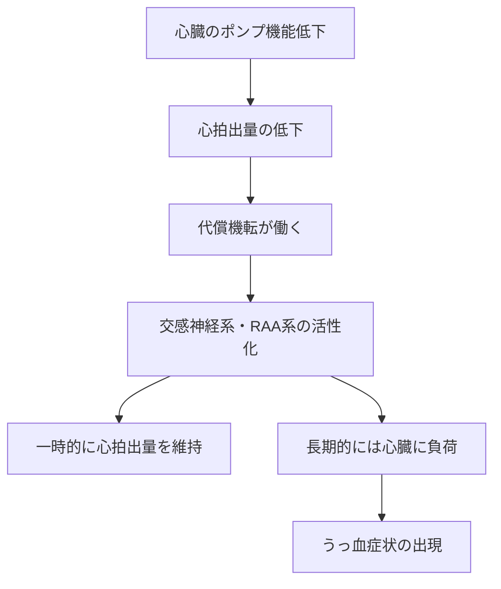

# Unit A-2 文章だけじゃない: 画像生成の仕組みと使いどころ

**対応コンピテンシー**: A2, A4 ｜ **所要時間の目安**: 10分

<div data-area-progress></div>

## なぜこのスキルが必要か

ある教育担当医が、深夜に研修医向け講義のスライドを仕上げていました。文章の下書きは生成AIで手早く作れたので、「図解イラストも同じように作ってくれないか」と画像生成AIに心不全の病態生理図を頼んだところ、見た目には整った図が数秒で返ってきました。ところが後で見返すと、心房と心室の位置関係が実際とは異なっていて、そのまま使えばかえって誤解を招く出来でした。「文章を書かせるのと同じ感覚で頼んだのに、なぜこんな誤りが起きるのか」——それは、画像生成AIの多くが文章生成AIとは異なる仕組みで動いているためです。加えて、生成AIは文章や画像だけでなく、スライドの構成案やプログラムコードなど、業務に役立つ多様な形式を生成できます。この仕組みの違いと守備範囲の広さを知っておくことが、生成AIを講義準備や資料作成に安全かつ効果的に活用する第一歩です。

## コアの解説

### 画像生成AI(拡散モデル)の仕組み — LLMとは原理が違う

- [Unit A-1](a1.md)で見たLLMは、「直前の文脈から次に来る語を確率的に予測する」仕組みでした。
- 一方、多くの画像生成AI(拡散モデル、diffusion model)は、ランダムな砂嵐のようなノイズを含む画像から出発し、指示された内容に近づくよう少しずつノイズを取り除いていくことで、1枚の画像を復元していく仕組みです。
- 比喩で言うと、曇ったガラス越しの景色から、少しずつ曇りを拭き取っていくと像が浮かび上がってくるようなイメージです。輪郭を1本ずつ描き足しているわけではありません。
- この仕組みの違いから、画像生成AIは「文章としてのもっともらしさ」と同じ意味で「画像としての解剖学的な正確さ」を保証してはいません。文章のハルシネーション(Unit A-1)と同じ発想で、画像にも「もっともらしいが誤った見た目」が生じることがあります。

### 生成AIはテキスト以外も作れる(マルチモーダル)

- 生成AIには、文章に加えて、画像、スライドの構成案、プログラムコード、音声、図表(Mermaidなどの記法によるフローチャート)といった多様な形式を生成できるものがあります。
- 医療者の業務での使いどころの例:
    - 講義スライドの構成案・図解のたたき台
    - 患者説明資料の下書き(文章+簡単な図解案)
    - 学会発表のスライド構成・要旨のたたき台
- いずれも「たたき台(下書き)」である前提は変わりません。そのまま使わず、内容を確認・修正することが必要です([Unit C-2](c2.md)で学ぶ検証の考え方と同じです)。

## コピー可能なプロンプト

画像生成ツールを使わなくても、「生成AIがテキスト以外の形式を作る」ことは体験できます。以下は、同じ臨床テーマについて、(1)講義スライドの構成案と(2)図解のコード(Mermaid記法)の両方を作らせて比べるプロンプトです。

```text
【演習: スライド構成案と図解コードを作らせる】
私は[講義テーマを記入。例:「心不全の病態生理」「敗血症の初期対応」]について、
研修医向けの10分間ミニレクチャーを準備しています。次の2つを作成してください。

1. スライド構成案: 5枚分のスライドタイトルと、各スライドの箇条書き(3点まで)
2. 図解コード: 上記の内容の流れを表す図を、Mermaid記法のフローチャート
   (「mermaid」から始まるコードブロック)で作成してください

作成後、この2つの出力がそれぞれ「文章」「図」のどちらの体裁の生成物かを
一言で説明してください。
```

## 手順

1. プロンプト内の[ ]を、自分の担当領域や興味のあるテーマに書き換えます。
2. 手元の生成AIに貼り付けて実行します。
3. スライド構成案(文章形式)と、Mermaidコード(図解の設計図)という、性質の異なる2つの出力が得られたことを確認します。
4. 使っている生成AIが対応していれば、会話の中でMermaidコードがそのまま図として表示されます。表示されない場合は、コードをMermaid対応のツール(例: mermaid.live)に貼り付けるか、コードの構造(矢印でつながる各要素)を読むだけでも、AIが「図としてのまとまり」を組み立てていることを確認できます。
5. ここで生成した図解コードも、実は拡散モデルではなく、文章生成AIと同じ「次の語を予測する仕組み」で作られていることに注目します。写真やイラストのような画像そのものの生成には拡散モデルの仕組みが広く使われています(近年はLLMと同じ予測の仕組みで画像を作るタイプもあります)が、その体験は本ユニットの範囲外です(コアの解説を参照)。

## 期待される出力の例

AIからは、次のような2種類の出力が返ってきます(説明用の架空の例です)。

**スライド構成案の例:**

```text
1枚目: 心不全とは何か(定義と有病率)
2枚目: 病態生理の全体像(ポンプ機能の低下から始まる悪循環)
3枚目: 代償機転(交感神経系・レニン-アンジオテンシン系の活性化)
4枚目: 代償が破綻するとどうなるか(うっ血症状の出現)
5枚目: 治療の基本方針との対応(病態生理を踏まえた薬剤選択の考え方)
```

**図解コードの例(Mermaid記法):**



スライド構成案は「文章」、図解コードはMermaidという記法で書かれた「図の設計図」であり、見た目も体裁もまったく異なります。本サイト上ではこのコードはそのまま図として描画はされず、テキストとして表示されます(体裁の違いを確認する目的では、これで十分です)。

## うまくいかない典型パターンと対処

- **Mermaidコードがそのまま図として表示されない**: 生成AIチャットの種類によっては、コードのテキストのまま表示されることがあります。その場合は、コードの構造(矢印でつながる各要素)を読むだけでも、AIが「図としての構成」を組み立てていることは確認できます。
- **スライド構成案が抽象的すぎる**: 「対象者」「時間」「レベル」等のコンテキストを追加すると具体的になります(領域Bで学ぶコンテキスト付与の考え方の先取りです)。
- **「実際に画像そのものを生成させたい」と思った場合**: 本ユニットで扱うのはテキストベースの体験までです。実際の画像生成AIの利用は、次節の解剖学的な誤りや著作権のリスクを伴うため、別途の学習が必要です(本サイトでは今後の拡張として検討中です)。

## 安全上の注意

!!! danger "患者情報を入力しないでください"
    実験の際、実際の患者に関する情報(氏名・患者ID・生年月日・詳細な病歴など)は絶対に入力しないでください。自分の担当領域や一般的な興味関心のテーマだけで実験は成立します。

さらに、実際に画像生成AIを使う際は、次の点にも注意してください。

- **解剖学的な誤りが起こりうる**: 拡散モデルは医学的な正確性を保証する仕組みではなく、「それらしい見た目」を復元しているに過ぎません。生成された医学図解には、臓器の位置・数・接続関係などに誤りが紛れることがあり、専門家による確認なしに講義や患者説明に使ってはいけません。
- **著作権に注意する**: 生成された画像が、既存のイラスト・写真・キャラクターに酷似することがあります([Unit C-2](c2.md)参照)。公開・配布する前に、既存作品との酷似の有無と、利用しているサービスの規約を確認してください。

## 自己チェッククイズ

このユニットの理解度を確認できます。合否の判定はなく、記録も保存されません。

<div data-quiz-src="../../assets/data/quiz-a2-selfcheck.json"></div>

## 成果物フィードバック

演習を行った対話の最後に、[フィードバックAI](../feedback.md)ページの採点プロンプトを貼り付けて送信すると、AIから講評が返ってきます。送信するときは、先頭に「Unit A-2の成果物です」と書き添えてください。この提出は任意で、領域Aの目録発行の条件ではありません。

## 次へ

理解を確認できたら、[領域Aクイズ](../quiz/a.md)に挑戦しましょう。目録の発行条件はクイズ合格のみのため、ユニットを読んでいなくても挑戦して構いません。

## 参考資料(任意)

- 黄世捷「NotebookLMの教育活用」(日本医学教育学会 ICT教育委員会シンポジウム 第4回, 2026-03-11): [スライドPDF](https://drive.google.com/file/d/1-NkV9DXOGiisLLYm0nullsGkW3jNxxkw/view?usp=drive_link) / [講演動画](https://vimeo.com/1176540890/f8b75946d3)

ツール固有の操作方法を含む内容のため、時間の経過とともに画面表示等が変わっている可能性があります。参照しなくても本ユニットは完結します。
